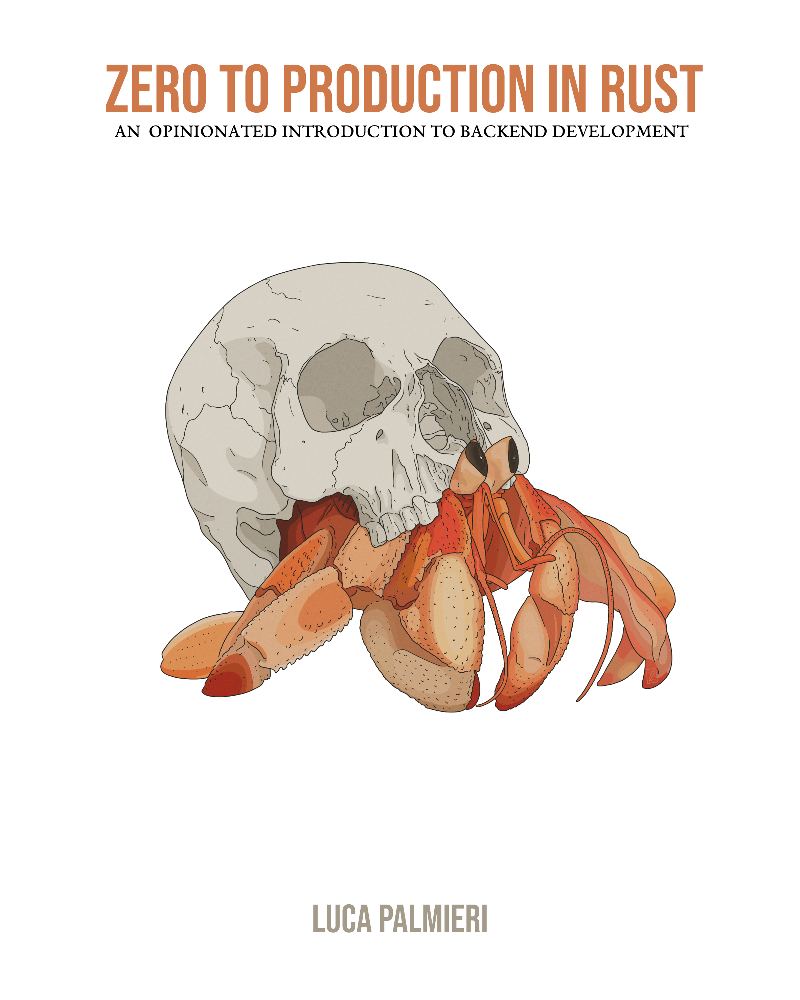

# 源码

> 一些书籍或者教程的源码整理

- [源码](#源码)
  - [操作系统](#操作系统)
  - [存储](#存储)
    - [Redis](#redis)
    - [MySQL](#mysql)
  - [编程语言](#编程语言)
    - [CPP](#cpp)
    - [Java](#java)
    - [Rust](#rust)
    - [Lua](#lua)
    - [JavaScript](#javascript)
  - [网络](#网络)
  - [Linux/Unix](#linuxunix)
  - [Windows](#windows)
  - [云计算](#云计算)
  - [编辑器](#编辑器)
  - [性能优化](#性能优化)
    - [eBPF](#ebpf)
  - [AI](#ai)
  - [其他](#其他)

## 操作系统

- [《Orange ‘s 一个操作系统的实现》](./src/Orange‘s一个操作系统的实现)

  

- [《30天自制操作系统》](./src/30天自制操作系统)

  

- [《x86 汇编语言：从实模式到保护模式》](./src/x86-assemble-from-real-mode-to-protect-mode)

  

- [《Computer Systems：A Programmer's Perspective，3/E (CS:APP3e)》/《深入理解计算机操作系统 - 第三版》](./src/cs_app3e)
  > 官方网站：<http://csapp.cs.cmu.edu/3e/code.html>

  
  

## 存储

### Redis

- 《Redis 设计与实现》
  > 官方地址：<https://huangz.works/redisbook1e/#>

  

- [《Redis In Action》](./src/redis-in-action)
  > 官方提提供下载地址：<https://www.manning.com/books/redis-in-action>

  

### MySQL

- [《MySQL 技术内幕：SQL 编程》](./src/MySQL技术内幕：SQL编程)

  

- [《MySQL 必知必会》](./src/MySQL.Crash.Course)
  > 官方提供下载地址：<https://forta.com/books/0672327120/>

  

- [《MySQL Cookbook Fourth Edition》](./src/mysqlcookbook)
  > Github 地址：<https://github.com/svetasmirnova/mysqlcookbook>

  

## 编程语言

### CPP

- [《Essential C++》](./src/essential-cpp)
  > 官方提供下载地址：<http://www.informit.com/store/essential-c-plus-plus-9780201485189>

  

- [《C++ Primer 第五版》](./src/CPP-Primer-5th-GCC_4_7_0)
  > 官方提供下载地址：<http://www.informit.com/store/c-plus-plus-primer-9780321714114>

  
  

- [《C++ Primer 第五版的答案》](./src/Cpp-Primer-5th-answer)

- [《Cpp API Design》/《C++ API 设计》](./src/cpp-api-design)

  
  

- [《C++ 并发编程实践》/《C++ Concurrency in Action》](./src/CCiA_SourceCode)
  > 官方提供下载地址：<https://www.manning.com/books/c-plus-plus-concurrency-in-action>

  
  

- [《C++11/14 高级编程 Boost 程序库探秘 - 第三版》](./src/C++11_14高级编程_Boost_程序库探秘_第三版)

  

- [Modern C++ Tutorial：C++11/14/17/20 On the Fly](./src/modern-cpp-tutorial)
  > Github： <https://github.com/changkun/modern-cpp-tutorial>

  
  

### Java

- [《Java 核心编程第第 10 版》](./src/corejava10)
  > - 官网地址：<http://horstmann.com/corejava/>
  > - 官方下载地址：<https://horstmann.com/corejava/corejava10.zip>

- [《Java 核心编程第第 11 版》](./src/corejava11)
  > - 官网地址：<http://horstmann.com/corejava/>
  > - 官方下载地址：<https://horstmann.com/corejava/corejava11.zip>

- [《Java 核心编程第第 12 版》](./src/corejava12)
  > - 官网地址：<http://horstmann.com/corejava/>
  > - 官方下载地址：<https://horstmann.com/corejava/corejava12.zip>

  
  

- [《On Java 8》](./src/OnJava8-Examples)
  > - Github: <https://github.com/BruceEckel/OnJava8-Examples>
  > - 官网: <https://www.onjava8.com>

  

- [The Go Programming Language](./src/gopl.io)
  > - Github：<https://github.com/adonovan/gopl.io/>
  > - 官方地址：<http://www.gopl.io/>

  

- [《100 Go Mistakes and How to Avoid Them》](./src/100-go-mistakes) - [原始代码地址](https://github.com/teivah/100-go-mistakes)

  

- [《Go 语言设计与实现》](./src/go-internal)

  

- [《Go 语言高级编程》](./src/anvanced-go-programming)

  - Github：<https://github.com/RainbowMango/GoExpertProgramming>

  

  - [《Go 专家编程》](./src/GoExpertProgramming)

  

- [《Writing A Compiler In Go/用 Go 语言自制解释器》](./src/wacig_code_1.2)，国内叫做**金猴书**

  
  

- [《Writing An Interpreter In Go/用 Go 语言自制编译器》](./src/waiig_code_1.3)，国内叫做**彩猴书**

  
  >

- [《Learn Concurrent Programming With Go》](./ConcurrentProgrammingWithGo)
  > Github: <https://github.com/cutajarj/ConcurrentProgrammingWithGo>

  

### Rust

- [《Black Hat Rust》](./src/black-hat-rust)

  

- [《Rust 编程之道》](./src/tao-of-rust-codes)
  > Github: <https://github.com/ZhangHanDong/tao-of-rust-codes>

  

- [《Zero To Production In Rust》](./src/zero-to-production)
  > Github: <https://github.com/LukeMathWalker/zero-to-production>

  

### Lua

- [《百万在线：大型游戏服务端开发》](./src/million_game_server)
  > Github: <https://github.com/luopeiyu/million_game_server>

  

- [《自己动手实现 Lua》](./src/luago-book)

  

### JavaScript

- [阮一峰的 JavaScript 教程](./src/ruanyifeng-javascript-tutorial)
  > - 原始代码地址: <https://github.com/wangdoc/javascript-tutorial>
  > - 教程地址: <https://wangdoc.com/javascript/index.html>
## 网络

- [《Compute-Network-Top-Down-Approach》/《计算机网络-自定向下的方法-第六版》](./src/Compute-Network-Top-Down-Approach)

  
  

## Linux/Unix

- [《Advanced Programming in the UNIX® Environment，Third Edition》/《UNIX 环境高级编程 (第 3 版)》](./src/apue.v3)
  > 官方地址：<http://www.apuebook.com/>

  
  

- [《UNIX Network Programming，Volume 1，Third Edition Source Code》/《UNIX 网络编程卷 1：套接字联网 API (第 3 版》](./src/unpv13e)
  > 官方地址：<http://www.unpbook.com/src.html>

  
  

- [《高性能 Linux 编程》](./src/高性能Linux编程)

  

- [《Linux/Unix 系统编程手册》](./src/TLPI)

  
  

- [《Linux 程序设计第 4 版》](./src/beginning-linux-programming-4th-edition)

  
  

- [《LINUX 设备驱动程序》/《Linux Device Drivers 3》](./src/ldd3)

  
  

- [《Linux 内核 0.11 完全注释》](./src/linux-kernel-0.11)

- [《Linux 内核 0.12 完全注释》](./src/linux-kernel-0.12)

- [《Linux 环境编程：从应用到内核》](./src/Linux环境编程:从应用到内核)

  - Linux 内核版本 3.2.44
  - glibc 的版本

- [《深入理解 Linux 网络 - 修炼底层内功、掌握高性能原理》](./src/deep_linux_network_tests)
  > Github 地址：<https://github.com/yanfeizhang/deep_linux_network_tests>

  

## Windows

- [Windows 内核安全与驱动开发](./src/Windows-kernel-security-and-driver-development)

## 云计算

- [《自己动手写 Docker》](./src/自己动手写Docker)

  

## 编辑器

- [《Vim 实用技巧 - 第一版》](./src/practice-vim-code)

  
  

- [《Modern Vim：Craft Your Development Environment with Vim 8 and Neovim》](./src/modvim-code)

  > 官方网站：<https://pragprog.com/titles/modvim/modern-vim/>，提供了源码以及其他的资源。

  

## 性能优化

### eBPF

- [《Linux Observability with BPF》](./src/linux-observability-with-bpf)
  > Github 地址：<https://github.com/bpftools/linux-observability-with-bpf>

  

- [《Learning eBPF》](./src/learning-ebpf)
  > Github 地址：<https://github.com/lizrice/learning-ebpf>

  

## AI

- [《GPT 图解》](./src/GPT图解)

  

- [《大模型应用开发极简入门：基于 ChatGPT-4 和 ChatGPT》](./src/gpt_examples-openai1.3/)
  > Github 地址：<https://github.com/malywut/gpt_examples/tree/openai1.3>

  
  

## 其他

- [《The Pragmatic Programmer - your journey to mastery》/《程序员修炼之道：通向务实的最高境界 - 第二版》](./src/the-pragmatic-programmer-2nd)

  
  

- [《大话设计模式》](./src/大话设计模式)

  

- [《Qt 5 编程入门》](./src/Qt5编程入门)

  

- [《QtCreator 快速入门-第 3 版》](./src/QtCreator快速入门-第3版)

  

- [《GPU 精粹三部》](https://github.com/shangzongyu/GPU-Gems-Book-Source-Code)

  

- [《gRPC - Up & Running》](./src/grpc-up-and-running)
  > Github 地址：<https://github.com/grpc-up-and-running/samples>

  
