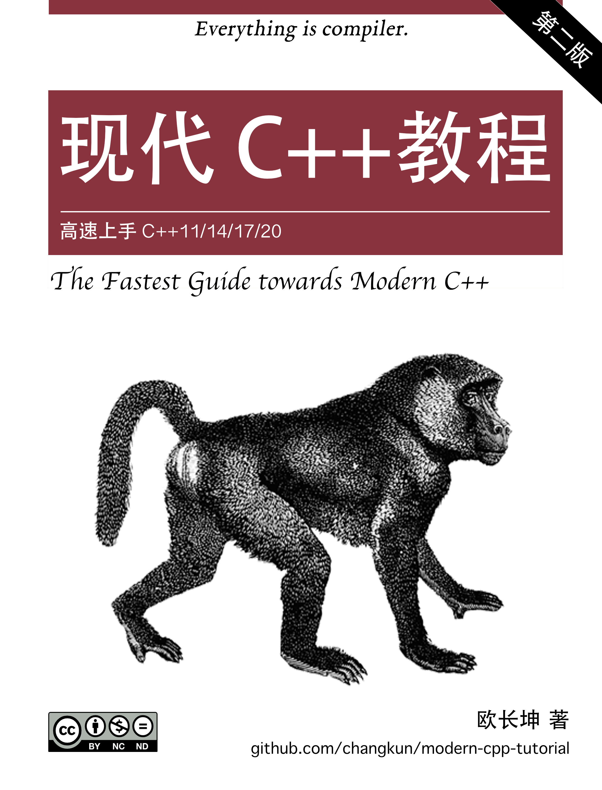

# 源码

> 一些书籍的源码整理

- [源码](#源码)
  - [操作系统](#操作系统)
  - [存储](#存储)
  - [编程语言](#编程语言)
  - [网络](#网络)
  - [Linux/Unix](#linuxunix)
  - [Windows](#windows)
  - [云计算](#云计算)
  - [编辑器](#编辑器)
  - [其他](#其他)

## 操作系统

- [《Orange‘s 一个操作系统的实现》](./Orange‘s一个操作系统的实现)

  | 中文                                                             |
  | ---------------------------------------------------------------- |
  |  |

- [《30天自制操作系统》](./30天自制操作系统)

  | 中文                                                   |
  | ------------------------------------------------------ |
  |  |

- [《x86 汇编语言：从实模式到保护模式》](./x86-assemble-from-real-mode-to-protect-mode)

  | 中文                                                                 |
  | -------------------------------------------------------------------- |
  |  |

- [《Computer Systems: A Programmer's Perspective, 3/E (CS:APP3e)》/《深入理解计算机操作系统 - 第三版》](./cs_app3e)[官方网站](http://csapp.cs.cmu.edu/3e/code.html)

  | 英文                                                | 中文                                                   |
  | --------------------------------------------------- | ------------------------------------------------------ |
  |  |  |

## 存储

- [《Redis In Action》](./redis-in-action) - 官方提提供下载地址 <https://www.manning.com/books/redis-in-action>

  | 英文                                                        |
  | ----------------------------------------------------------- |
  |  |

- [《MySQL技术内幕：SQL编程》](./MySQL技术内幕：SQL编程)

  | 中文                                                         |
  | ------------------------------------------------------------ |
  |  |

- [《MySQL 必知必会》](./MySQL.Crash.Course) - 官方提供[下载地址](https://forta.com/books/0672327120/)

  | 中文                                                     |
  | -------------------------------------------------------- |
  |  |

## 编程语言

- [《Essential C++》](./essential-cpp) - 官方提供[下载地址](http://www.informit.com/store/essential-c-plus-plus-9780201485189)

  | 中文                                                 |
  | ---------------------------------------------------- |
  |  |

- [《C++ Primer 第五版》](./CPP-Primer-5th-GCC_4_7_0) - 官方提供[下载地址](http://www.informit.com/store/c-plus-plus-primer-9780321714114)

  | 英文                                                 | 中文                                                     |
  | ---------------------------------------------------- | -------------------------------------------------------- |
  |  |  |

- [《C++ Primer 第五版的答案》](./Cpp-Primer-5th-answer)

- [《Cpp API Design》/《C++ API 设计》](./cpp-api-design)

  | 英文                                                 | 中文                                                    |
  | ---------------------------------------------------- | ------------------------------------------------------- |
  |  |  |

- [《C++ 并发编程实践》/《C++ Concurrency in Action》](./CCiA_SourceCode) - 官方提供[下载地址](https://www.manning.com/books/c-plus-plus-concurrency-in-action)

  | 英文                                                            | 中文                                                               |
  | --------------------------------------------------------------- | ------------------------------------------------------------------ |
  |  |  |

- [《C++11/14高级编程 Boost程序库探秘 - 第三版》](./C++11_14高级编程_Boost_程序库探秘_第三版)

  | 中文                                                                            |
  | ------------------------------------------------------------------------------- |
  |  |

- [Modern C++ Tutorial: C++11/14/17/20 On the Fly](./modern-cpp-tutorial), Github 的[下载地址](https://github.com/changkun/modern-cpp-tutorial)

  | 英文                                                                | 中文                                                                   |
  | ------------------------------------------------------------------- | ---------------------------------------------------------------------- |
  |  |  |

- [《Java 核心编程第10版》](./corejava10) - 官方提供[下载地址](http://horstmann.com/corejava/)

- [《自己动手实现 Lua》](./luago-book)

  

- [《Rust 编程之道》](./tao-of-rust-codes) - 原始代码[Github](https://github.com/ZhangHanDong/tao-of-rust-codes)

  | 中文                                                    |
  | ------------------------------------------------------- |
  |  |

## 网络

- [《Compute-Network-Top-Down-Approach》/《计算机网络-自定向下的方法-第六版》](./Compute-Network-Top-Down-Approach)

  | 英文                                                                     | 中文                                                                       |
  | ------------------------------------------------------------------------ | -------------------------------------------------------------------------- |
  |  |  |

## Linux/Unix

- [《Advanced Programming in the UNIX® Environment, Third Edition》/《UNIX环境高级编程（第3版）》](./apue.v3)

  | 英文                                                | 中文                                                   |
  | --------------------------------------------------- | ------------------------------------------------------ |
  |  |  |

- [《UNIX Network Programming, Volume 1, Third Edition Source Code》/《UNIX 网络编程 卷1：套接字联网API（第3版》](./unpv13e)

  | 英文                                                | 中文                                                |
  | --------------------------------------------------- | --------------------------------------------------- |
  |  |  |

- [《高性能 Linux 编程》](./高性能Linux编程)

  

- [《Linux/Unix 系统编程手册》](./TLPI)

  | 英文                                        | 中文                                          |
  | ------------------------------------------- | --------------------------------------------- |
  |  |  |

- [《Linux 程序设计 第4版》](./beginning-linux-programming-4th-edition)

  | 英文                                                                           | 中文                                                                             |
  | ------------------------------------------------------------------------------ | -------------------------------------------------------------------------------- |
  |  |  |

- [《LINUX 设备驱动程序》/《Linux Device Drivers 3》](./ldd3)

  | 英文                                       | 中文                                          |
  | ------------------------------------------ | --------------------------------------------- |
  |  |  |

- [《Linux 内核 0.11 完全注释》](./linux-kernel-0.11)

- [《Linux 内核 0.12 完全注释》](./linux-kernel-0.12)

- [《Linux环境编程：从应用到内核》](./Linux环境编程:从应用到内核)
  - Linux 内核版本 3.2.44
  - glic 的版本

## Windows

- [Windows 内核安全与驱动开发](./Windows-kernel-security-and-driver-development)

## 云计算

- [《自己动手写 Docker》](./自己动手写Docker)

  | 中文                                                   |
  | ------------------------------------------------------ |
  |  |

## 编辑器

- [《Vim实用技巧 - 第一版》](./practice-vim-code)

  | 英文                                                    | 中文                                                       |
  | ------------------------------------------------------- | ---------------------------------------------------------- |
  |  |  |

## 其他

- [《The Pragmatic Programmer - your journey to mastery》/《程序员修炼之道 ：通向务实的最高境界 - 第二版》]

  | 英文                                                    | 中文                                                       |
  | ------------------------------------------------------- | ---------------------------------------------------------- |
  |  |   |

- [《大话设计模式》](./大话设计模式)

  | 中文                                               |
  | -------------------------------------------------- |
  |  |

- [《Qt 5编程入门》](./Qt5编程入门)

  | 中文                                              |
  | ------------------------------------------------- |
  |  |

- [《QtCreator 快速入门-第3版》](./QtCreator快速入门-第3版)

  | 中文                                                    |
  | ------------------------------------------------------- |
  |  |

