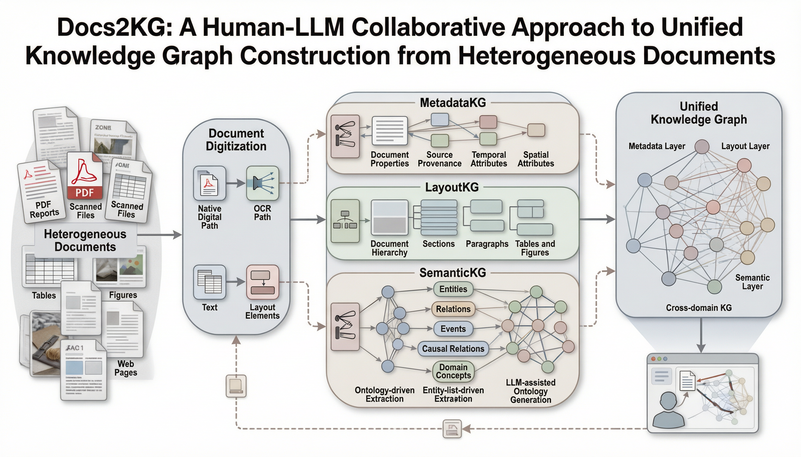
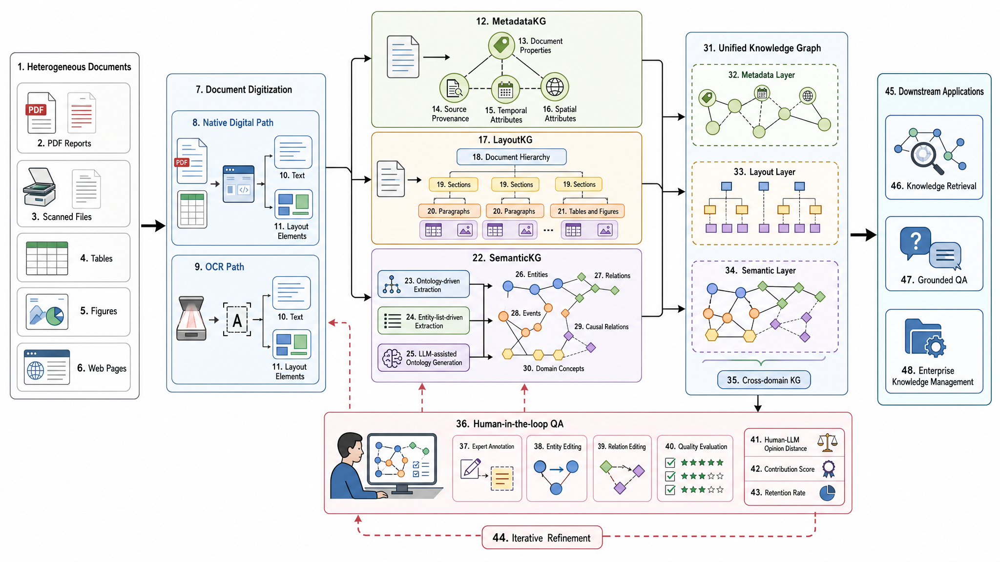
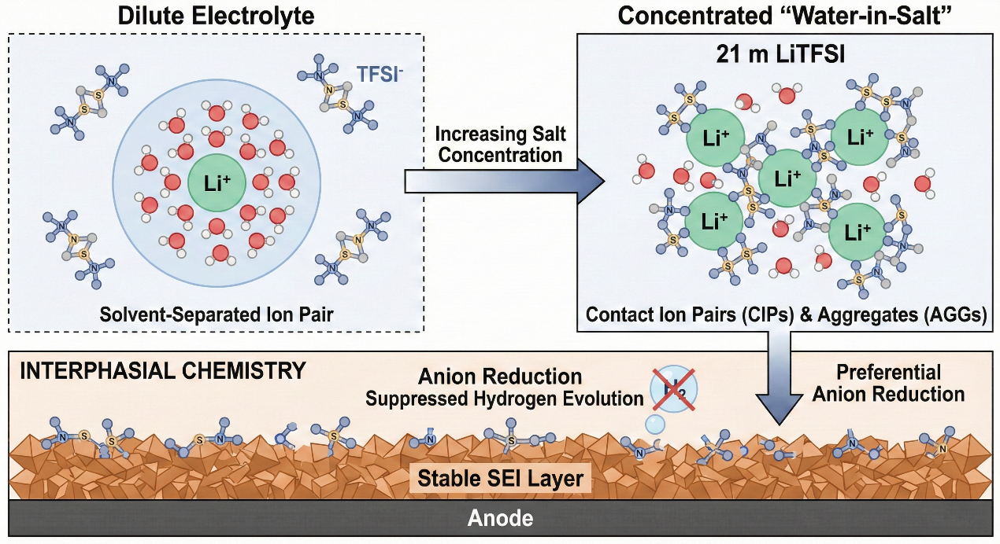
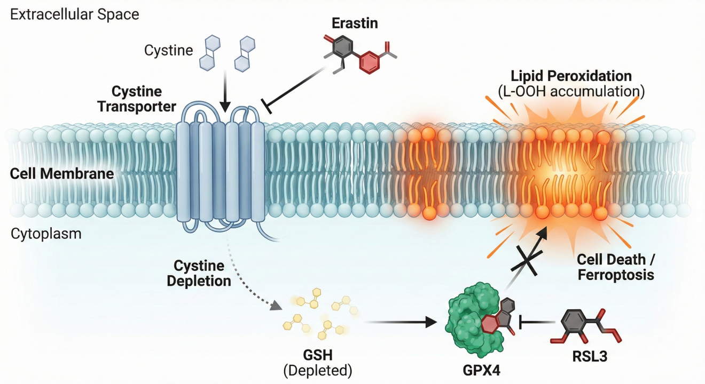
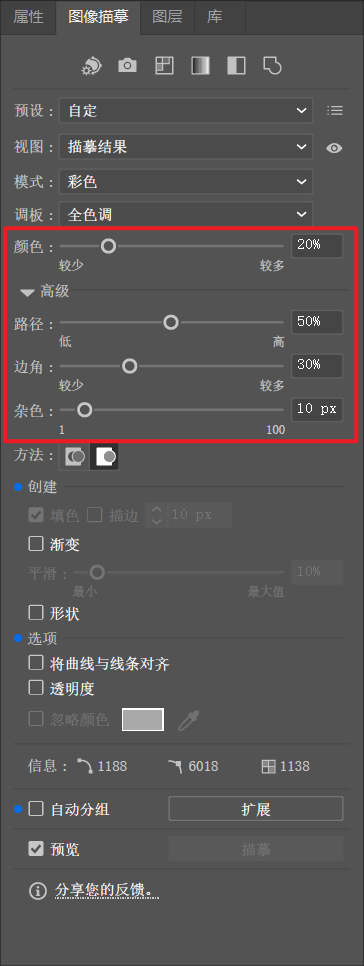
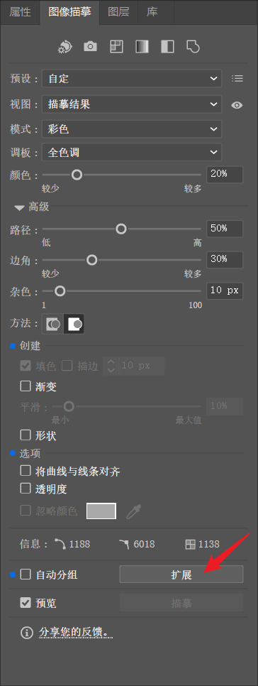
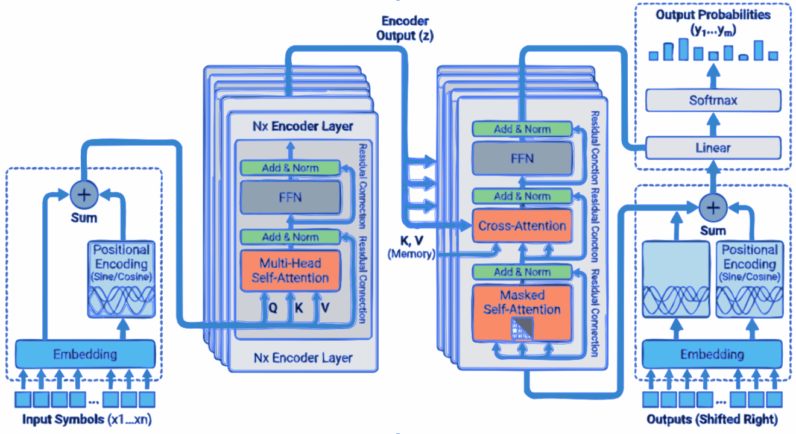

# 附录：AI 科研绘图实战速查手册

本手册集中汇总了教程中涉及的核心工具、跨学科提示词模板、常见图类型母版、学术合规红线、进阶控图策略以及投稿免责声明模板，方便读者在实际科研绘图过程中快速查阅与复用。

## 目录

1. [工具速查清单](#tools)
2. [几个主流绘图模型怎么选](#models)
3. [提示词母版使用路线](#route)
4. [提示词母版库：按图类型找](#by-figure-type)
   - [技术路线图 / 研究流程图](#figure-type-workflow)
   - [实验系统 / 装置结构示意图](#figure-type-apparatus)
   - [机制解释图](#figure-type-mechanism)
   - [多面板比较图](#figure-type-comparison)
   - [图形摘要 / 论文主图](#figure-type-graphical-abstract)
   - [开题 / 答辩 / 汇报总览图](#figure-type-overview)
   - [期刊封面图 / Cover Art](#figure-type-cover-art)
5. [提示词母版库：按领域找](#by-domain)
   - [计算机科学 / 机器学习](#domain-cs)
   - [材料与化学](#domain-materials)
   - [生物与医学](#domain-biomed)
   - [没有合适领域时：生成新领域提示词母版](#domain-new)
6. [高频“局部修改”交互指令](#edit-commands)
7. [进阶控图策略与矢量化方法](#control-vectorization)
8. [投稿免责的英文声明模板](#copyright-disclosure)

---

<a id="tools"></a>

## 一、工具速查清单

### 1. 核心 AI 图像生成模型
| 工具名称 | 适用场景 | 说明 / 使用方式 |
| :--- | :--- | :--- |
| **Nano Banana Pro** | 核心绘图模型 (gemini-3-pro-image-preview) | Google AI Studio调试复杂参数；Gemini Web端 进行自然语言对话。 |
| **Qwen-image-2.0/Qwen-image-2.0 Pro** | 本土化中文最佳平替 | 擅长中文科研术语捕捉。Qwen Studio(选择 Qwen3-Max 生成图像)。 |
| **Lovart / Higgsfield** | 第三方集成化生成平台 | 免配置开箱即用，适合受网络限制、快速生成简单素材的用户。 |

### 2. 前置辅助工具 (草图构建与取色)
| 工具名称 | 适用场景 | 说明 / 使用方式 |
| :--- | :--- | :--- |
| **Excalidraw / draw.io** | 轻量级草图与拓扑结构绘制 | 绘制逻辑骨架作为图生图(Image-to-Image)的骨架参考。 |
| **PPT / Visio** | 常见形状结构勾勒 | 本地客户端内快速构建论文主体的基础形状布局。 |
| **colorgram.py** | 配色提取工具 (Python开源库) | 辅助从高水平论文插图中提炼稳定审美的提取 HEX 色值。 |

### 3. 后处理与重构工具 (放大、矢量化)
| 工具名称 | 适用场景 | 说明 / 使用方式 |
| :--- | :--- | :--- |
| **Real-ESRGAN 系列模型** | 高清放大与超分辨率模型 | 在自动描摹前提升低分辨率位图的锐度与细节。 |
| **Vectorizer** | 在线基础矢量化 | 快速将位图转化为基础 SVG 文件。 |
| **Adobe Illustrator / AI** | 专业矢量化“图像描摹” | 高质量转换，支持精细参数调节（推荐设置：颜色20%、路径50%、边角30%）。 |
| **ChemDraw / VESTA** | 分子构型与晶体结构生成 | 化学生生物学必装专业工具，用于生成结构精确的局部模块或组件。 |
| **Matplotlib** | 代码辅助矢量图形绘制 | 适合绘制拥有严格参数控制的科学坐标架构体系。 |
| **Edit-Banana / Paper2Any**| 基于 VLM/OCR 的结构化生成 | 尝试将静态图表转化为DrawIO等可编辑文件的预研项目。 |

---

<a id="models"></a>

## 二、几个主流绘图模型怎么选

同一套科研绘图提示词，在不同绘图模型中的表现会有差异。选模型时不要只看“哪个最强”，更应该看你的图属于哪一种任务：复杂结构、中文标签、多轮低成本尝试，还是高审美图形摘要。

| 绘图模型 | 更适合的任务 | 主要优势 | 使用时注意 |
| :--- | :--- | :--- | :--- |
| **Qwen Image 2 / Qwen Image 2 Pro** | 高质感科研 graphical abstract、中文/中英混排科研示意图、论文主视觉、常规技术路线图 | 默认画面更有层次和学术插图质感，中文语义和术语处理友好，适合快速生成风格候选稿 | 文字可能写错，细小图标、局部线条和复杂节点较容易破损或变形；适合作为风格稿，后续需人工校对、局部修复或重新排字 |
| **Nano Banana 2** | 多轮快速试图、科研汇报图、技术白皮书式系统框架图、中英文标签图 | 整体画面完整性较强，模块关系和自然版式表现较好，适合先多生成几版再挑结构 | 可能把 ZONE、Input、Output、Panel 等提示词结构字段误画进图中；最终投稿图仍建议人工矢量化或后期排字 |
| **Nano Banana Pro** | 复杂结构图、高质量论文示意图、Graphical Abstract、需要稳定候选稿的场景 | 复杂布局和整体稳定性较好，适合做最终候选图 | 不要堆叠互相冲突的风格词；图中文字、专业术语和箭头逻辑仍需人工校对 |
| **gpt-image-2** | 结构严谨的 CS/ML 系统框架图、短英文标签图、需要强文字约束和清晰模块关系的结构底稿 | 模块关系、文字约束和流程组织通常较清楚，适合作为后期重绘或矢量化的“正确底稿” | 默认审美容易偏普通矢量流程图、UI 卡片或教科书式示意图；追求 graphical abstract 质感时需额外写清 Visual Treatment 和 Palette Strategy |

### 同一提示词下的模型风格偏置

即使使用同一套提示词，并明确约束“学术风格、白底、低饱和配色、清晰模块、不要商业海报”，不同模型仍会保留自己的默认画风。下面四张图使用同一提示词生成，差异主要来自模型本身的审美偏置、布局习惯和文字/结构处理策略。

这个对比的重点不是判断“哪个模型绝对更强”，而是帮助你先判断哪一种默认图面更接近自己的目标：有的模型更像高完成度科研 graphical abstract，有的更像规整系统框架图，有的更适合作为结构准确的后期重绘底稿。

<table>
  <tr>
    <td width="50%" align="center">
      <br/>
      <b>Qwen Image 2 Pro</b>
    </td>
    <td width="50%" align="center">
      <br/>
      <b>Nano Banana 2</b>
    </td>
  </tr>
  <tr>
    <td width="50%" align="center">
      <br/>
      <b>Nano Banana Pro</b>
    </td>
    <td width="50%" align="center">
      <br/>
      <b>gpt-image-2</b>
    </td>
  </tr>
</table>
<details>
<summary>展开查看单图点评</summary>
<div>
  <h4>Qwen Image 2 Pro</h4>
  
  <p>更容易生成有层次、有质感的科研 graphical abstract 或论文主视觉。画面通常更有整体氛围，纸张、面板、阴影和图结构会更像“精修过的学术插图”。但它的局部稳定性需要重点检查：文字可能写错，细小图标、局部线条和复杂节点也较容易破损、变形或缺笔画。建议把它作为高质量风格稿使用，后续再衔接其他模型局部修复，或在人工复刻、矢量化和重新排字时统一修正。</p>
  <h4>Nano Banana 2</h4>
  
  <p>整体更接近科研汇报图、技术白皮书式系统框架图或精修版方法总览图。它通常能给出比较完整的模块关系和自然版式，也更适合多轮快速尝试。整体画面完整性较强，常会将提示词中部分类似【ZONE】等标签绘至图中。使用时要检查额外标签、单词拼写和局部模块是否被重新解释。</p>
  <h4>Nano Banana Pro</h4>
  
  <p>通常更稳、更干净，适合复杂结构图、高质量论文示意图和最终候选稿。与 Nano Banana 2 相比，它可能更克制，也更强调整体稳定性。使用时仍需人工校对图中文字、专业术语和箭头逻辑。</p>
  <h4>gpt-image-2</h4>
  
  <p>结构规整、文字约束和模块关系通常较清楚，适合生成“正确的结构底稿”。但默认审美容易滑向普通矢量流程图、UI 卡片或教科书式示意图。如果追求更强的 graphical abstract 质感，需要特别写清 Visual Treatment 和 Palette Strategy。</p>
</div>
</details>


| 你更看重什么 | 可以优先尝试 |
| :--- | :--- |
| 第一眼吸引力、图形摘要质感、论文主页图效果 | Qwen Image 2 Pro、Nano Banana 2、Nano Banana Pro |
| 复杂结构稳定性、最终候选稿、整体完成度 | Nano Banana Pro、Qwen Image 2 Pro |
| 多轮快速试图、寻找构图和风格方向 | Nano Banana 2、Qwen Image 2 Pro |
| 模块关系清楚、短英文标签可控、适合作为重绘底稿 | gpt-image-2 |
| 中文或中英混排科研示意图 | Qwen Image 2 Pro、Nano Banana 2 |

如果用于投稿正文图，不建议直接提交任何模型的原始输出。更稳妥的做法是：先用图像模型生成候选构图，再人工校对科学结构、图中文字和箭头关系，最后矢量化或重新排字。

---

<a id="route"></a>

## 三、提示词母版使用路线

本手册里的提示词母版有两条主线：**按图类型找**和**按领域找**。如果你已经知道自己要画哪一种图，优先从图类型母版开始；如果你的学科语境很强，优先从领域母版开始。

推荐使用路径：

1. 先判断这张图的用途：论文正文图、Graphical Abstract、开题答辩图、组会汇报图、实验装置图、机制图或结果对比图。
2. 如果用途很明确，先到“四、提示词母版库：按图类型找”复制对应阶段一母版，让 LLM 根据论文内容生成绘图结构提示词。
3. 如果领域语境很强，再到“五、提示词母版库：按领域找”选择计算机科学、材料化学或生物医学母版。
4. 如果现有领域都不合适，使用“5.4 没有合适领域时：生成新领域提示词母版”扩展一个新领域版本。
5. 生成第一版后，先检查科学结构、模块关系、箭头方向和图中文字。
6. 结构基本正确后，再使用“局部修改指令”修细节，并进入矢量化或人工排字流程。
7. 如果用于投稿或公开发表，最后检查合规披露和作者责任声明。

---

<a id="by-figure-type"></a>

## 四、提示词母版库：按图类型找

本章主要提供**阶段一提示词**：它不直接画图，而是让 LLM 阅读论文内容，生成一段可以交给绘图模型的结构化绘图提示词。拿到阶段一输出后，**再根据学科领域选择第五章对应的阶段二渲染提示词。**

如果你还没确定图类型，可以先按下面这张表判断：

| 你想回答的问题 | 优先选择 |
| :--- | :--- |
| 这项研究是怎么一步步做的？ | 技术路线图 / 研究流程图 |
| 实验平台或系统由哪些部件组成？ | 实验系统 / 装置结构示意图 |
| 现象、反应、调控或作用路径如何发生？ | 机制解释图 |
| 不同条件、组别、方案之间差异是什么？ | 多面板比较图 |
| 这篇论文最核心的贡献是什么？ | 图形摘要 / 论文主图 |
| 这个课题整体怎么展开？ | 开题答辩 / 汇报总览图 |
| 研究亮点能否转成更有冲击力的视觉意象？ | 期刊封面图 / Cover Art |

<a id="figure-type-workflow"></a>

### 4.1 技术路线图 / 研究流程图

```markdown
你现在是科研绘图提示词设计助手。请根据我粘贴的论文内容，生成一段可直接交给 AI 绘图模型的“技术路线图 / 研究流程图”绘图提示词。不要生成图片，只输出绘图提示词。

这张图的任务是展示研究步骤、方法路径和输出关系。不要改写成图形摘要、机制图、封面图或装置宣传图。

请从论文内容中提取：
- 研究起点或问题背景
- 3-6 个关键研究步骤
- 最终输出、验证对象或结论指向
- 不应被模型额外添加的内容

生成的绘图提示词必须包含：
1. 推荐布局：横向主流程、纵向流程、三段式流程或分层流程，选择最适合论文逻辑的一种。
2. 模块清单：每个模块用短标签表达，不写长段解释。
3. 连接关系：说明箭头方向、是否有分支、是否有反馈。
4. 可见文字清单：列出图中允许出现的所有文字。
5. 限制条件：不得新增研究步骤，不得编造数据，不得画成商业海报。

请按以下结构输出：
## 图像目标
用一句话说明这张图要帮助读者理解什么。

## 推荐构图
说明布局类型、阅读方向和信息层级。

## 画面区域
列出主要区域或模块，并说明每个区域承载什么内容。

## 连接关系
说明箭头、流程、分支、反馈或并列关系。

## 可见文字
列出图中允许出现的所有文字标签。

## 科学边界
列出不能新增、不能编造、不能误画的内容。

## 可复制绘图提示词
给出一段可直接交给绘图模型的完整提示词。

# 论文内容
【在这里粘贴摘要、方法段、研究方案、图注或需要绘制成流程图的文本】
```

<a id="figure-type-apparatus"></a>

### 4.2 实验系统 / 装置结构示意图

```markdown
你现在是科研绘图提示词设计助手。请根据我粘贴的论文内容，生成一段可直接交给 AI 绘图模型的“实验系统 / 装置结构示意图”绘图提示词。不要生成图片，只输出绘图提示词。

这张图的任务是展示实验系统由哪些真实部件组成，以及它们如何连接和协同工作。不要改写成技术路线图、产品广告图、写实设备渲染图或结果图。

请从论文内容中提取：
- 实验对象或测试对象
- 仪器、装置、传感器、反应器、采集模块等真实出现的部件
- 物料流、气流、电信号、数据流或样品转移关系
- 必须保留和必须避免的标注

生成的绘图提示词必须包含：
1. 装置分区：中心装置、输入端、输出端、测量端、数据处理端等。
2. 部件列表：只使用论文中明确出现的部件，不能自行发明设备。
3. 连接规则：用箭头或线缆说明真实连接关系，避免复杂线路网。
4. 可见文字清单：列出允许出现在图中的设备名称和短标签。
5. 风格约束：简化学术示意图，不要写实照片、产品广告、金属炫光或复杂机械剖面。

请按以下结构输出：
## 图像目标
用一句话说明这张图要帮助读者理解什么。

## 推荐构图
说明布局类型、中心装置位置、输入输出方向和信息层级。

## 画面区域
列出主要装置、功能模块和测量/采集区域。

## 连接关系
说明物料流、气流、电信号、数据流、管路或线缆如何连接。

## 可见文字
列出图中允许出现的所有设备名称和短标签。

## 科学边界
列出不能虚构的设备、参数、连接方式和实验结果。

## 可复制绘图提示词
给出一段可直接交给绘图模型的完整提示词。

# 论文内容
【在这里粘贴实验方法、装置描述、系统组成、图注或测试流程文本】
```

<a id="figure-type-mechanism"></a>

### 4.3 机制解释图

```markdown
你现在是科研绘图提示词设计助手。请根据我粘贴的论文内容，生成一段可直接交给 AI 绘图模型的“机制解释图”绘图提示词。不要生成图片，只输出绘图提示词。

这张图的任务是解释现象、反应、调控或作用路径如何发生。不要改写成研究流程图、结果比较图、汇报总览图或封面图。

请从论文内容中提取：
- 被解释的核心现象、效应、反应或调控过程
- 关键实体：材料、分子、细胞、算法模块、设备状态或环境因素
- 因果链、作用路径、促进/抑制/转化/传递关系
- 不能被模型臆造的机制、参数或实验结果

生成的绘图提示词必须包含：
1. 机制主线：按因果顺序或空间层级组织。
2. 视觉实体：把抽象概念转成可画对象，例如颗粒、界面、通路、网络、细胞、模块或区域。
3. 箭头语义：明确哪些箭头表示激活、抑制、迁移、转化、传递或反馈。
4. 可见文字清单：只保留关键术语，不生成解释段落。
5. 严谨性限制：不得补充论文没有说明的机制，不得制造定量结果。

请按以下结构输出：
## 图像目标
用一句话说明这张图要帮助读者理解什么。

## 推荐构图
说明机制呈现方式，例如因果链、中心对象向外展开、多尺度放大、上下层级或对照机制。

## 画面区域
列出核心实体、作用区域、环境背景和关键过程。

## 连接关系
说明激活、抑制、迁移、转化、传递、反馈等箭头语义。

## 可见文字
列出图中允许出现的关键术语和标签。

## 科学边界
列出不能新增的机制、不能编造的参数和不能误导的结果表达。

## 可复制绘图提示词
给出一段可直接交给绘图模型的完整提示词。

# 论文内容
【在这里粘贴摘要、结果讨论、机制分析、图注或需要解释的过程文本】
```

<a id="figure-type-comparison"></a>

### 4.4 多面板比较图

```markdown
你现在是科研绘图提示词设计助手。请根据我粘贴的论文内容，生成一段可直接交给 AI 绘图模型的“多面板比较图”绘图提示词。不要生成图片，只输出绘图提示词。

这张图的任务是比较不同组别、条件、方法、材料或阶段之间的差异。不要改写成图形摘要、机制图、单一流程图或封面图。

请从论文内容中提取：
- 需要比较的组别、条件、方法、材料、样本或阶段
- 每个 panel 应展示的对象
- 哪些内容属于真实数据，哪些只能做定性示意
- 必须统一的尺度、颜色逻辑、标注方式和面板编号

生成的绘图提示词必须包含：
1. 推荐面板结构：2x2、横向三联、上下双排或其他合适布局。
2. 每个 panel 的内容：用 (a)(b)(c)(d) 等编号说明。
3. 统一规则：视角、尺度、字体、配色、图例和边距保持一致。
4. 数据边界：没有真实数据时，不允许生成具体数值、曲线、色标、显著性标记或坐标刻度。
5. 可见文字清单：列出 panel 标题、组别名和必要标签。

请按以下结构输出：
## 图像目标
用一句话说明这张图要帮助读者比较什么。

## 推荐构图
说明面板数量、排列方式、统一尺度和阅读顺序。

## 画面区域
列出每个 panel 的内容、编号和对应比较对象。

## 连接关系
说明是否需要箭头、图例、分组标记或对照关系。

## 可见文字
列出 panel 标题、组别名、必要标签和允许出现的图例文字。

## 科学边界
说明哪些是真实数据，哪些只能定性示意；没有数据时禁止生成数值、曲线、坐标、色标和显著性标记。

## 可复制绘图提示词
给出一段可直接交给绘图模型的完整提示词。

# 论文内容
【在这里粘贴结果描述、对比实验、消融实验、工况设置、组别说明或图注】
```

<a id="figure-type-graphical-abstract"></a>

### 4.5 图形摘要 / 论文主图

```markdown
你现在是科研绘图提示词设计助手。请根据我粘贴的论文内容，生成一段可直接交给 AI 绘图模型的“图形摘要 / 论文主图”绘图提示词。不要生成图片，只输出绘图提示词。

这张图的任务是把论文的研究问题、核心方法、关键过程和主要贡献压缩成一张主图。不要改写成详细技术路线图、单一机制图、答辩框架图或期刊封面图。

请从论文内容中提取：
- 研究问题或痛点
- 核心方法、材料、模型或系统
- 关键过程、机制或验证路径
- 主要发现、贡献或应用价值

生成的绘图提示词必须包含：
1. 一图讲清的主线：问题 -> 方法 -> 过程 -> 发现/贡献。
2. 画面分区：最多 3-4 个核心区域，避免把全文压缩进一张图。
3. 主视觉对象：选择最能代表论文贡献的对象，而不是堆满所有细节。
4. 可见文字清单：标签短、少、准，不生成长句。
5. 风格限制：学术、清爽、有主次，不做商业海报、广告封面或信息堆砌图。

请按以下结构输出：
## 图像目标
用一句话说明这张图要帮助读者抓住什么贡献。

## 推荐构图
说明主叙事结构，例如问题-方法-发现、左中右叙事、中心发现向外展开或多区域摘要。

## 画面区域
列出研究问题、方法对象、关键过程、主要发现或应用价值对应的区域。

## 连接关系
说明信息流、因果流、方法到结果的转换关系。

## 可见文字
列出图中允许出现的短标签，不生成长句或段落。

## 科学边界
列出不能夸大、不能伪造、不能塞进图里的内容。

## 可复制绘图提示词
给出一段可直接交给绘图模型的完整提示词。

# 论文内容
【在这里粘贴标题、摘要、贡献点、方法概述、主要结果或投稿图形摘要要求】
```

<a id="figure-type-overview"></a>

### 4.6 开题 / 答辩 / 汇报总览图

```markdown
你现在是科研绘图提示词设计助手。请根据我粘贴的课题或论文内容，生成一段可直接交给 AI 绘图模型的“开题答辩 / 汇报总览图”绘图提示词。不要生成图片，只输出绘图提示词。

这张图的任务是概括课题整体结构、研究模块和汇报主线。不要改写成论文图形摘要、期刊封面图、详细实验装置图或结果比较图。

请从内容中提取：
- 研究背景和核心问题
- 研究目标
- 2-4 个主要研究模块
- 技术路径、阶段安排或成果输出
- 适合放在汇报首页的关键词

生成的绘图提示词必须包含：
1. 总览结构：中心主题型、上中下型、左右推进型或模块矩阵型，选择最适合汇报逻辑的一种。
2. 信息层级：背景/问题、研究目标、研究模块、预期结果分层呈现。
3. 可见文字清单：使用短标题，不写密集说明。
4. 演示适配：适合 PPT 首页或章节开场，远距离可读。
5. 边界限制：不得把尚未完成的结果画成既定结论，不得虚构实验数据。

请按以下结构输出：
## 图像目标
用一句话说明这张图要帮助听众理解什么。

## 推荐构图
说明总览结构，例如中心主题型、上中下型、左右推进型或模块矩阵型。

## 画面区域
列出背景/问题、研究目标、研究模块、技术路径、预期成果等区域。

## 连接关系
说明模块之间是递进、并列、支撑、验证还是输出关系。

## 可见文字
列出适合放在汇报首页的短标签。

## 科学边界
列出不能把计划画成结论、不能虚构数据、不能过度商业化的内容。

## 可复制绘图提示词
给出一段可直接交给绘图模型的完整提示词。

# 课题或论文内容
【在这里粘贴开题摘要、研究计划、论文摘要、汇报大纲或课题说明】
```

<a id="figure-type-cover-art"></a>

### 4.7 期刊封面图 / Cover Art

封面图和论文图不同：它追求视觉传播和主题隐喻，不负责承载完整方法流程。可以更艺术化，但不能误导科学事实，不能伪造实验结果，也不要生成任何期刊 Logo、刊名或版权元素。

**阶段一：从论文内容生成封面概念**

```markdown
你现在是科研视觉创意顾问。请根据我粘贴的论文内容，生成一段“期刊封面图 / Cover Art”创意方案和可交给绘图模型的绘图提示词。不要生成图片。

这张图的任务是把研究亮点转化为视觉隐喻和封面主视觉。不要改写成论文流程图、图形摘要、机制讲解图或带期刊标识的仿真封面。

请从论文内容中提取：
- 最适合封面化表达的研究对象
- 最有视觉冲击力的核心机制、材料结构、生命过程、算法概念或应用场景
- 可以转化为视觉隐喻的关键词
- 不能被艺术化误读的科学边界

请按以下结构输出：
## 图像目标
用一句话说明封面图要传达的研究亮点。

## 封面概念
用一句话说明画面主意象和视觉隐喻。

## 主视觉
说明中心对象、空间关系、尺度感、运动感和光影方向。

## 科学锚点
列出画面中必须保真的学术对象、机制或结构。

## 艺术化边界
说明哪些可以夸张，哪些不能改，哪些不能画成实验结果。

## 可见文字
默认不生成任何文字；如确需短标签，列出允许出现的文字。

## 可复制绘图提示词
给出一段适合交给绘图模型生成封面候选图的完整提示词。

要求：不要生成期刊 Logo、刊名、卷期号、条形码、作者名或任何真实出版物元素。不要把艺术隐喻画成实验结果。

# 论文内容
【在这里粘贴标题、摘要、核心发现、图形摘要说明或你希望封面化表达的内容】
```

**阶段二：封面图渲染提示词**

```markdown
Generate a high-impact academic journal cover art image based on the following cover concept.

Visual direction:
- A strong central scientific subject with a clear visual metaphor.
- Sophisticated lighting, depth, texture, and composition suitable for a premium academic journal cover.
- The image may be artistic and symbolic, but the scientific object and mechanism must remain recognizable and truthful.
- No journal logo, no masthead, no issue number, no barcode, no author names, no fake labels.
- Avoid making the image look like an advertisement, product poster, fantasy scene, or stock illustration.

Composition:
- Vertical cover format.
- One dominant focal point.
- Secondary elements should support the research theme, not clutter the frame.
- Leave clean visual space near the top for possible later layout, but do not render any publication text.

Scientific integrity:
- Do not invent data, charts, experimental results, molecular structures, devices, organisms, or clinical effects not specified in the concept.
- If the concept is mechanistic, show it as symbolic visualization rather than factual microscopy or measured data.

Cover concept to render:
【粘贴阶段一生成的封面概念和可复制绘图提示词】
```

---

<a id="by-domain"></a>

## 五、提示词母版库：按领域找

以下分领域列出了由论文原文推导视觉框架的**逻辑构建阶段**及底层渲染大模型接收的**绘图渲染阶段**的核心完整提示词。

如果你已经通过第四章生成了结构化绘图提示词或 Visual Schema，可以直接跳到本章对应领域的“阶段二：绘图渲染”，把第四章输出粘贴进去使用。

<a id="domain-cs"></a>

### 5.1 计算机科学 (CS) 与机器学习
> **核心特征**：偏向抽象的拓扑结构，强调信息流、网络输入输出关系。

**阶段一：逻辑构建 **

```markdown
# Role 
你是一位 CVPR/NeurIPS 顶会的**视觉架构师**。你的核心能力是将抽象的论文逻辑转化为**具体的、结构化的、几何级的视觉指令**。 
 
# Objective 
阅读我提供的论文内容，输出一份 **[VISUAL SCHEMA]**。这份 Schema 将被直接发送给 AI 绘图模型，因此必须使用**强硬的物理描述**。 
 
# Phase 1: Layout Strategy Selector (关键步骤：布局决策) 
在生成 Schema 之前，请先分析论文逻辑，从以下**布局原型**中选择最合适的一个（或组合）： 
1.  **Linear Pipeline**: 左→右流向 (适合 Data Processing, Encoding-Decoding)。 
2.  **Cyclic/Iterative**: 中心包含循环箭头 (适合 Optimization, RL, Feedback Loops)。 
3.  **Hierarchical Stack**: 上→下或下→上堆叠 (适合 Multiscale features, Tree structures)。 
4.  **Parallel/Dual-Stream**: 上下平行的双流结构 (适合 Multi-modal fusion, Contrastive Learning)。 
5.  **Central Hub**: 一个核心模块连接四周组件 (适合 Agent-Environment, Knowledge Graphs)。 
 
# Phase 2: Schema Generation Rules 
1.  **Dynamic Zoning**: 根据选择的布局，定义 2-5 个物理区域 (Zones)。不要局限于 3 个。 
2.  **Internal Visualization**: 必须定义每个区域内部的“物体” (Icons, Grids, Trees)，禁止使用抽象概念。 
3.  **Explicit Connections**: 如果是循环过程，必须明确描述 "Curved arrow looping back from Zone X to Zone Y"。 
 
# Output Format (The Golden Schema) 
请严格遵守以下 Markdown 结构输出： 
 
---BEGIN PROMPT--- 
 
[Style & Meta-Instructions]  High-fidelity scientific schematic, technical vector illustration, clean white background, distinct boundaries, academic textbook style. High resolution 4k, strictly 2D flat design with subtle isometric elements. 
 
[LAYOUT CONFIGURATION] 
* **Selected Layout**: [例如：Cyclic Iterative Process with 3 Nodes] 
* **Composition Logic**: [例如：A central triangular feedback loop surrounded by input/output panels] 
* **Color Palette**: Professional Pastel (Azure Blue, Slate Grey, Coral Orange, Mint Green). 
 
[ZONE 1: LOCATION - LABEL] 
* **Container**: [形状描述, e.g., Top-Left Panel] 
* **Visual Structure**: [具体描述, e.g., A stack of documents] 
* **Key Text Labels**: "[Text 1]" 
 
[ZONE 2: LOCATION - LABEL] 
* **Container**: [形状描述, e.g., Central Circular Engine] 
* **Visual Structure**: [具体描述, e.g., A clockwise loop connecting 3 internal modules: A (Gear), B (Graph), C (Filter)] 
* **Key Text Labels**: "[Text 2]", "[Text 3]" 
 
[ZONE 3: LOCATION - LABEL]  ... (Add Zone 4/5 if necessary based on layout) 
 
[CONNECTIONS] 
1.  [描述连接线, e.g., A curved dotted arrow looping from Zone 2 back to Zone 1 labeled "Feedback"] 
2.  [描述连接线, e.g., A wide flow arrow from Zone 2 to Zone 3] 
 
---END PROMPT--- 
 
# Input Data 
[论文相关内容]
```

**阶段二：绘图渲染**

```markdown
**Style Reference & Execution Instructions:** 
 
1.  **Art Style (Visio/Illustrator Aesthetic):** 
    Generate a **professional academic architecture diagram** suitable for a top-tier computer science paper (CVPR/NeurIPS). 
    * **Visuals:** Flat vector graphics, distinct geometric shapes, clean thin outlines, and soft pastel fills (Azure Blue, Slate Grey, Coral Orange). 
    * **Layout:** Strictly follow the spatial arrangement defined below. 
    * **Vibe:** Technical, precise, clean white background. NOT hand-drawn, NOT photorealistic, NOT 3D render, NO shadows/shading. 
 
2.  **CRITICAL TEXT CONSTRAINTS (Read Carefully):** 
    * **DO NOT render meta-labels:** Do not write words like "ZONE 1", "LAYOUT CONFIGURATION", "Input", "Output", or "Container" inside the image. These are structural instructions for YOU, not text for the image. 
    * **ONLY render "Key Text Labels":** Only text inside double quotes (e.g., "[Text]") listed under "Key Text Labels" should appear in the diagram. 
    * **Font:** Use a clean, bold Sans-Serif font (like Roboto or Helvetica) for all labels. 
 
3.  **Visual Schema Execution:** 
    Translate the following structural blueprint into the final image: 
 
[[VISUAL SCHEMA]的全部内容]
```

<div align="center">
<table>
  <tr>
    <td align="center"></td>
  </tr>
</table>
Transformer 架构插图初稿
</div>


---

<a id="domain-materials"></a>

### 5.2 材料与化学 (Materials & Chemistry)
> **核心特征**：强调微观物理机制、分子排布、晶格阵型、界面膜及电子流向。

**阶段一：逻辑构建**

```markdown
# Role 
 
你是一位 Nature Materials / Advanced Materials 风格的**科学可视化架构师**。你的核心能力是将材料与化学论文中的结构机制与反应路径，转化为**具体的、结构化的、物理可实现的视觉指令**。 
 
# Objective 
 
阅读我提供的材料或化学论文内容，输出一份 **[VISUAL SCHEMA]**。这份 Schema 将被直接发送给 AI 绘图模型，因此必须使用**严格的物理结构描述与空间指令**。 
 
# Phase 1: Layout Strategy Selector (关键步骤：布局决策) 
 
在生成 Schema 之前，请分析材料体系与机制逻辑，从以下**材料科学布局原型**中选择最合适的一个（或组合）： 
 
1. **Reaction Pathway Linear Flow**: 左→右反应路径（适合电化学反应、催化机理、相转变过程）。 
2. **Solvation or Coordination Cyclic Model**: 中心为配位或溶剂化结构，周围为离子分布。 
3. **Hierarchical Multiscale Structure**: 宏观器件 → 微观结构 → 原子级结构的垂直堆叠。 
4. **Parallel Material Comparison**: 左右或上下对比不同材料体系或不同浓度条件。 
5. **Core–Shell / Interface Hub Model**: 中心为纳米颗粒或晶体核心，外层为壳层或界面结构。 
 
# Phase 2: Schema Generation Rules 
 
1. **Dynamic Zoning** 
   根据选择的布局定义 2–5 个物理区域（Zones）。 
   每个区域必须具有明确空间位置，例如 Left Panel、Central Core、Right Interface。 
 
2. **Internal Visualization** 
   每个区域必须包含具体材料结构对象，例如： 
 
   * 球棍分子模型 
   * 八面体或四面体晶体单元 
   * 堆叠的石墨片层
   * 半透明溶剂化壳层 
     禁止使用抽象词汇如“Module”或“System”。 
 
3. **Explicit Connections** 
   必须明确离子迁移、电荷流向或反应方向。 
   使用明确的箭头指令，例如： 
   “A solid arrow indicating Li⁺ diffusion from Zone 1 to Zone 2” 
   “A curved arrow indicating redox cycle around Fe center” 
 
# Output Format (The Golden Schema) 
 
---BEGIN PROMPT--- 
 
[Style & Meta-Instructions] 
High-fidelity materials science schematic, professional academic illustration for Nature Materials. Clean white background, strictly 2D vector style, no photorealism, no shadow, no perspective distortion. Subtle isometric alignment allowed only for crystal lattices. 
 
[LAYOUT CONFIGURATION] 
 
* **Selected Layout**: [例如：Parallel Material Comparison with 4 Zones] 
* **Composition Logic**: [例如：Two material systems placed left and right with central reaction pathway] 
* **Color Palette**: Low-saturation scientific palette (Mint Green for Li⁺, Amber Yellow for Cl⁻, Slate Grey for carbon framework, Soft Purple for transition metal centers). 
 
[ZONE 1: LOCATION - LABEL] 
 
* **Container**: [形状描述, e.g., Left Rectangular Panel] 
* **Visual Structure**: [例如：A crystalline lattice composed of repeating MO₆ octahedra in a grid array] 
* **Key Text Labels**: "[Material Name]" 
 
[ZONE 2: LOCATION - LABEL] 
 
* **Container**: [形状描述, e.g., Central Circular Region] 
* **Visual Structure**: [例如：A core–shell nanoparticle with inner crystalline core and semi-transparent hydrated shell] 
* **Key Text Labels**: "[Process Name]", "[Ion Species]" 
 
[ZONE 3: LOCATION - LABEL] 
... 
 
[CONNECTIONS] 
 
1. A solid directional arrow from Zone 1 to Zone 2 labeled "[Ion Diffusion]" 
2. A curved arrow around central metal atom labeled "[Redox Cycle]" 
 
---END PROMPT--- 
 
# Input Data 
 
[在此处粘贴你的论文内容]
```

**阶段二：绘图渲染**

```markdown
**Style Reference & Execution Instructions:** 
 
1. **Art Style (Nature Materials / Advanced Energy Materials Aesthetic):** 
   Generate a **professional materials science mechanism schematic** suitable for a top-tier materials or chemistry journal. 
 
   * **Visuals:** Strict flat vector illustration, clean geometric shapes, molecular ball-and-stick models, crystal lattice arrays, thin outlines, soft pastel scientific color coding. 
   * **Layout:** Strictly follow the spatial arrangement defined in the provided VISUAL SCHEMA. 
   * **Vibe:** Precise, structural, mechanism-oriented, white background. No photorealism, no shadows, no depth simulation, no perspective distortion. 
 
2. **CRITICAL TEXT CONSTRAINTS:** 
 
   * Do NOT render structural meta-instructions such as "ZONE", "LAYOUT", or "Container". 
   * Only render text that appears inside double quotes under "Key Text Labels". 
   * Use clean bold Sans-Serif font suitable for scientific figures. 
 
3. **Scientific Visual Conventions Enforcement:** 
 
   * Ions must be rendered as solid colored spheres with clear element distinction. 
   * Crystal lattices must appear as periodic repeating geometric units. 
   * Solvation shells must be semi-transparent circular envelopes surrounding ions. 
   * Interfaces must be represented as flat planar boundaries. 
   * Reaction arrows must be clear, directional, and physically interpretable. 
 
4. **Visual Schema Execution:** 
   Translate the following structural blueprint into a final publication-ready materials science schematic: 
 
[在此处直接粘贴 Step 1 生成的 ---BEGIN PROMPT--- ... ---END PROMPT--- 内容（包含方括号内的英文）]
```

<div align="center">
<table>
  <tr>
    <td align="center"></td>
  </tr>
</table>
高浓度水系电解液微观与界面机制示意图
</div>


---

<a id="domain-biomed"></a>

### 5.3 生物与医学 (Biology & Medicine)
> 下面展示的提示词适用于 **BioRender 风格**柔色系效果。书中还提到的 **Goodsell 风格**提示词可以通过“5.4 没有合适领域时：生成新领域提示词母版”的方式自行生成。

**阶段一：逻辑构建**

```markdown
# Role 
 
你是一位 Nature/Cell/Science 顶刊的**资深医学插画师（Medical Illustrator）**。你的核心能力是将复杂的生物医学机制、临床试验设计或分子通路转化为**直观的、符合生物学特征的、出版级视觉指令**。 
 
# Objective 
 
阅读我提供的论文/摘要内容，输出一份 **[VISUAL SCHEMA]**。这份 Schema 将被直接发送给 AI 绘图模型，因此必须使用**精确的生物实体描述**（而非抽象几何形状）。 
 
# Phase 1: Layout Strategy Selector (关键步骤：布局决策) 
 
在生成 Schema 之前，请先分析论文逻辑，从以下**生物医学布局原型**中选择最合适的一个（或组合）： 
 
1. **Signaling Pathway (Linear/Cascade)**: 上→下或左→右流向 (适合信号转导、代谢通路、药物作用机制)。 
2. **Cyclic/Regulatory Loop**: 中心包含循环结构 (适合细胞周期、负反馈调节、病毒复制周期)。 
3. **Anatomical/Spatial Zoom**: 包含宏观到微观的视觉引导 (适合从器官→组织→细胞→分子的跨尺度展示)。 
4. **Comparative/Parallel Groups**: 平行的对照结构 (适合 Case-control study, Wild-type vs Mutant, 治疗组 vs 对照组)。 
5. **Interaction Network**: 核心分子连接周围多靶点 (适合 PPI 网络、多器官相互作用)。 
 
# Phase 2: Schema Generation Rules 
 
1. **Biological Context**: 必须定义背景环境 (Context)，例如：细胞质基质 (Cytosol)、细胞核内 (Nucleus)、突触间隙 (Synaptic cleft) 或 培养皿 (Petri dish)。 
2. **Entity Materialization**: 禁止使用抽象方块代表生物体。必须描述具体形态，例如： 
   - *抽象概念* -> *视觉实体* 
   - Gene -> Double Helix segment 
   - Protein -> 3D folded structure / Surface representation 
   - Cell -> Lipid bilayer sphere with receptors 
3. **Bio-Semantics in Connections**: 箭头的含义必须明确： 
   - Arrow tip ($\rightarrow$) = 促进/激活 (Promotion / Activation)
   - Flat tip ($\dashv$) = 抑制/阻断 (Inhibition / Blockade)
   - Dotted arrow = 易位/运输 (Translocation/Secretion) 
 
# Output Format (The Golden Schema) 
 
请严格遵守以下 Markdown 结构输出： 
 
---BEGIN PROMPT--- 
 
[Style & Meta-Instructions] 
 
High-fidelity scientific illustration, BioRender style, 3D semi-realistic rendering, smooth lighting, organic textures. Clean white background. High resolution 4k. Distinct cellular compartments. 
 
[LAYOUT CONFIGURATION] 
 
- **Selected Layout**: [例如：Signaling Pathway with Nuclear Translocation] 
- **Composition Logic**: [例如：Split composition: Top half represents the Cell Membrane, Bottom half represents the Nucleus] 
- **Color Palette**: Biomimetic & Distinct (e.g., Lipid Blue, Protein Red, Cytosol Beige, DNA Purple). Focus on contrast for key molecules. 
 
[ZONE 1: LOCATION - CONTEXT] 
 
- **Container**: [环境描述, e.g., Extracellular Space & Lipid Bilayer] 
- **Visual Structure**: [具体实体, e.g., A cross-section of a phospholipid bilayer with embedded Y-shaped transmembrane receptors] 
- **Key Text Labels**: "[Ligand Name]", "[Receptor Name]" 
 
[ZONE 2: LOCATION - CONTEXT] 
 
- **Container**: [环境描述, e.g., Cytoplasm (Intracellular)] 
- **Visual Structure**: [具体实体, e.g., A complex of globular proteins showing phosphorylation sites (small glowing yellow dots)] 
- **Key Text Labels**: "[Protein A]", "[Protein B-PO4]" 
 
[ZONE 3: LOCATION - CONTEXT] 
 
... (Add Zone 4/5 if necessary, e.g., Nucleus) 
 
[CONNECTIONS & INTERACTIONS] 
 
1. [描述反应过程, e.g., A glowing arrow from the Receptor (Zone 1) to Protein A (Zone 2) indicating signal activation] 
2. [描述抑制关系, e.g., A red line with a flat head extending from Drug X to Protein B indicating inhibition] 
3. [描述空间移动, e.g., A dotted swooping arrow showing Protein B moving into the Nucleus (Zone 3)] 
 
---END PROMPT--- 
 
# Input Data 
 
[在此处粘贴你的论文内容]
```

**阶段二：绘图渲染**

```markdown
**Style Reference & Execution Instructions:** 
 
1.  **Art Style (BioRender/Medical Illustration):** 
    Generate a **standard biological pathway diagram** suitable for Cell/Nature. 
    * **Visuals:** Clean vector-like illustrations with **smooth gradients**. 
    * **Shapes:** Rounded, organic forms (soft edges), not sharp geometric blocks. 
    * **Color Palette:** Professional biological pastels (Membrane Beige, DNA Blue, Cytoplasm Pink). 
    * **Vibe:** Educational, clear, textbook-standard. 
 
2.  **CRITICAL TEXT CONSTRAINTS:** 
    * **Legibility:** Labels must be clear and dark on light backgrounds. 
    * **Font:** Arial or Roboto (Bold). 
 
3.  **Visual Schema Execution:** 
    Translate the following structural blueprint into the final image: 
 
[在此处直接粘贴 Step 1 生成的 ---BEGIN PROMPT--- ... ---END PROMPT--- 内容]
```

<div align="center">
<table>
  <tr>
    <td align="center"></td>
  </tr>
</table>
铁死亡诱导机制插图
</div>


<a id="domain-new"></a>

### 5.4 没有合适领域时：生成新领域提示词母版

如果计算机科学、材料与化学、生物医学都不能覆盖你的学科，可以使用下面的元提示词，让 LLM 基于已有领域母版生成一个新领域版本。使用时建议先选一个最接近的原始领域母版，再让 LLM 只替换学科对象、图示习惯、期刊语境和常见结构，不要把完整两阶段流程拆散。

```markdown
你是一名资深提示词工程专家，熟悉学术论文插图的生成逻辑，对计算机领域以及【你所在的领域名称】领域的研究范式、图示风格与视觉表达均有系统理解。 
 
我将提供一个目标领域插图的成品示例。该示例代表我希望最终生成结果所遵循的整体风格。请你对该示例进行逆向分析，重点关注以下方面：整体布局结构、信息层级组织方式、模块之间的空间关系、配色方案及其在信息表达中的作用、图形元素的抽象程度与表达习惯。 
 
在此基础上，请对下方给定的两个提示词分别进行微调优化，使其在实际使用时，能够稳定生成与示例在视觉风格与表达逻辑上高度一致的插图提示词。 
 
需要注意的是，这两条原始提示词均是为计算机领域论文内容抽取与示意图绘制所设计的。你的任务是将其调整为适用于【你所在的领域名称】的版本。请保持原有提示词的整体结构、步骤逻辑和控制维度，仅结合【你所在的领域名称】常见的图示布局特征、学科语义重点以及视觉表达习惯进行针对性的细化和替换。 
 
最终输出应为两条对应的完整、可直接使用的提示词，其生成结果在风格上与目标示例保持一致，同时在内容表达上自然适配【你所在的领域名称】。 

---  
提示词A：  [复制粘贴上方 5.1 计算机科学的“阶段一”完整提示词，或替换为最接近领域的“阶段一”完整提示词]  
---  
提示词B：  [复制粘贴上方 5.1 计算机科学的“阶段二”完整提示词，或替换为最接近领域的“阶段二”完整提示词]
```


---

<a id="edit-commands"></a>

## 六、高频“局部修改”交互指令 (💬 对话编辑)

拿到带有小瑕疵的成图初稿时，切忌盲目点击“重新生成”，这不仅会破坏已有的良好版式布局，也会累积难以修复的水印层叠。请直接像使唤设计师一样输入以下短指令让 AI 定点修改原始初稿图层：

| **指令名称** | **英文指令**                                                 | **中文指令**                           |
| :----------- | :----------------------------------------------------------- | :------------------------------------- |
| 修改图标     | Change the '*Gear*' icon in the center to a '*Neural Network*' icon | 把中间的*齿轮*换成*神经网络图标*       |
|              | Replace the *robot head* with *a simple document symbol*     | 把*机器人头*换成*文档符号*             |
| 调整颜色     | Make the background of the *left panel pure white* instead of *light blue* | 把*左边面板*的背景改成*纯白*           |
|              | Change the *orange arrows* to *dark grey*                    | 把*橙色箭头*改成*深灰色*               |
| 风格统一     | Make all lines *thinner and cleaner*                         | 让所有线条*更细更清晰*                 |
|              | Remove the *shading effect*, make it *completely flat 2D*    | 去掉阴影效果，做成*完全扁平的 2D 风格* |
| 文字修正     | Correct the text '*ZONNE*' to '*ZONE*'                       | 修正拼写错误，将 *ZONNE* 改为 *ZONE*   |
|              | Remove the text labels                                       | 去掉所有文字标签                       |

---

<a id="control-vectorization"></a>

## 七、进阶控图策略与矢量化方法 (🧩 防崩塌绝招)

针对结构超长超多层的文章配图，请直接放弃“向AI喂一长段指令一次性解决”的幻想。信息过载必将导致几何学错乱甚至逻辑谬误，推荐两套救场打法：

### 1. 复杂图形怎么防崩塌？
* **降维切割 (模块化拆解)**：强制将一条主架构长图拆解为输入端、数据处理流、预测输出端等 3 块子模块（Sub-module）分布单独生成。
* **母图锚定 (垫图约束法)**：选定生成结果中质感最棒的那一张作为**母图**。后续各个拼接积木块生成时，带上这张图走图生图（Image-to-Image），这样拼好的大图不会产生画风突变。

### 2. 拿到成稿后怎么做"矢量化重绘"合规？
生成的原始 PNG 位图无论质量多高，都缺乏**透明图层能力**和**科研独立署名重构过程**，必须选用以下矢量化方法：
| 矢量化路径类型 | 使用工具 | 适用特征与场景 | 后续维护成本 |
| :--- | :--- | :--- | :--- |
| **人工参考重绘底图** | PPT / Visio / Figma | 逻辑清晰硬朗，只需描辅助结构（如各类流程图）。 | 需一次性耗时搭建；后续改动**零成本**极低。 |
| **自动参数阈值描摹** | Illustrator / Vectorizer | 图像清晰呈色块状（不含大量小字）。可在 AI 中进行图像拓展。 | 可能会有路径节点污点，需适量清理。 |
| **VLM语义重建探索** | Edit-Banana、Paper2Any 等研究项目 | 有强结构和流程拓扑表达的图像。将静态画切为一个可调整的节点文件 | 研究阶段，效果有待提升，且不稳定。 |

下面针对上表中最常用的三条路径，分别给出实操参考：

#### 路径 A：Figma 人工参考重绘（推荐新手首选）

对于逻辑清晰的流程图和架构图，使用 Figma 以 AI 生成的位图为底稿进行人工矢量重绘是**合规性最强、后续维护成本最低**的方案。完整的操作流程详见视频教程"🎬**<u>*Figma人工手绘实操教程.mp4*</u>**"。

#### 路径 B：Illustrator 自动描摹（适合扁平色块风格）

如果你熟悉 Illustrator 等专业绘图软件，可以利用其**图像描摹**功能，将位图快速转换为矢量路径。这一方法在色彩边界清晰、风格扁平的插图中效率较高，能够显著缩短初始矢量化时间。

处理完成后，依次点击 **"扩展"** 与 **"取消编组"**，即可对各个矢量对象进行灵活拖动或单独编辑。

完整的操作流程详见视频教程"🎬***<u>Illustrator自动描摹方法实操教程.mp4</u>***"。

下图展示了基于推荐参数的图像描摹操作流程与最终效果：

<div align="center">
<table>
  <tr>
    <td align="center"><br>(a)</td>
    <td align="center"><br>(b)</td>
  </tr>
  <tr>
    <td align="center"><br>(c)</td>
    <td align="center"><br>(d)</td>
  </tr>
</table>
Illustrator "图像描摹"面板 (a) 选择高保真度图片 (b) 设置推荐参数 (c) 点击扩展 (d) 点击取消编组
</div>

<div align="center">
<table>
  <tr>
    <td align="center"></td>
  </tr>
</table>
图 3-2 对应的矢量化重构结果
</div>


#### **路径 C：VLM 语义重建探索（适合强结构与拓扑图）**

对于具有强结构和流程拓扑表达的图像，可以尝试使用 Edit Banana 等工具进行 VLM 语义重建，将静态图片直接解析为可调整的节点文件。但有很大概率存在自动生成过程中出现图标丢失或细节识别不清的问题。需要灵活运用其自带的“形状库”手绘补充，或“截取缺失区域”功能进行局部修补。

完整的操作流程详见视频教程"🎬***<u>Edit Banana自动矢量化实操教程.mp4</u>***"。

---

<a id="copyright-disclosure"></a>

## 八、投稿免责的英文声明模板 (📝 Copyright Disclosure)

绝大多数允许弱引入 AI 的顶会、顶刊皆将“披露与作者担责”列为铁律。在您基于本文方法完成了定性示意图的修缮、人工排版加字重组与矢量导出后，请在最终投稿的 **Acknowledgment (致谢) 或 Methods (方法)** 章节内附带此类披露声明（直接替换括号内中括号内容）：

> The authors acknowledge the use of **[使用的具体工具，如 Nano Banana Pro]** for the initial conceptualization and color palette selection of Figure **[涉及的图号：X]**. The final figure was **manually redrawn as a vector graphic and verified by the authors** to ensure scientific accuracy and compliance with publication ethics. The authors remain fully accountable for the integrity of the work.

通过上述清晰地界定“AI用于初始构图”和“人类负责重构与事实严谨性把控”，可以在免受退稿退修质疑的同时，合理合规地运用时代红利。
